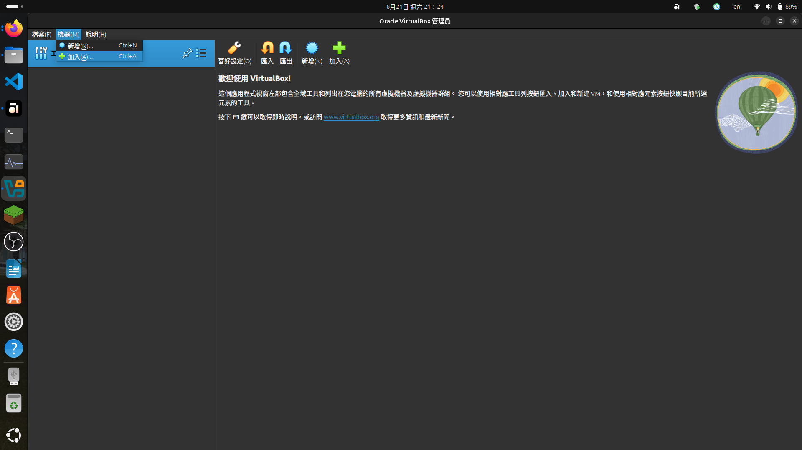

# UCSC Genome Browser in a Box (GBiB) 繁體中文版安裝說明

***

## 前置作業

1. 在您的 Ubuntu 24.04 系統當中，下載並安裝 Oracle Virtual Box。\
   安裝連結：[請點我](https://www.oracle.com/tw/virtualization/technologies/vm/downloads/virtualbox-downloads.html?source=:ow:o:p:nav:mmddyyVirtualBoxHero_tw\&intcmp=:ow:o:p:nav:mmddyyVirtualBoxHero_tw)
2. 接著在 Ubuntu 24.04 系統當中，下載並安裝 Genome Browser in a Box 的虛擬機器檔案。\
   （檔案大小 > 10 GB，可能要等待超過一小時）\
   安裝連結：[請點我](https://genome-store.ucsc.edu/)
3. 將下載下來的 "gbib.zip" 解壓縮
   1. 如果您偏好使用使用者介面，請使用滑鼠右鍵點選該壓縮檔案，然後選擇 「取出」 。
   2. 或者，可以使用命令列工具，使用以下 Bash 命令來移動到您存放該壓縮檔的目錄，並解壓縮：\
      （請將 `~/Target_dir` 替換成您存放該壓縮檔的實際資料夾）
      1. 提示：可以先使用 `find ~/ -type f -name "gbib.zip"` 找到檔案的位置。\
         應該會看到類似`/home/your_user_name/Target_dir/gbib.zip` 的輸出。在 `your_user_name`與 `gbib.zip` 之間的內容都是 `Target_dir` 。

<pre class="language-bash"><code class="lang-bash"><strong>cd ~/Target_dir
</strong><strong>unzip gbib.zip
</strong></code></pre>

4. 在解壓縮的資料夾（`gbib`）中，找到 `browserbox.vbox` 檔案，記下路徑。
5. 啟動 Oracle VirtualBox ，並按照以下順序操作，將該檔案新增至虛擬機器中。
   1. 點選 「機器」 ，然後選擇 「加入」 。
   2. 在彈出的視窗中，按照檔案路徑找到 `broserbox.vbox` ，並開啟它。

<figure><figcaption></figcaption></figure>

<figure><figcaption></figcaption></figure>

***

## 硬體配置設定

接下來，請依照以下步驟進行，確保虛擬機器能夠順利運作。

<figure><figcaption></figcaption></figure>

1. 點選 「設定」 。
2. 在 「設定」 視窗中，調整以下設定：
   1. 基礎記憶體： `6 GB`
   2. 處理器： `2 顆核心`
   3. 顯示：視訊記憶體調整為最大值的一半、縮放係數調整為 150%
   4. 存儲裝置：在 `SATA Controller` 下新增光碟機 `VBoxGuestAdditions.iso`，這樣才可以新增共用資料夾
   5.  網路：附加到 NAT ，連接埠轉送設定如下，並將 「線路已連接」 打勾\


       <figure><figcaption></figcaption></figure>
   6. 共用資料夾：資料夾路徑可以透過下拉選單指定自己要的資料夾；資料夾名稱可以自訂；掛載點設定為 /data/shared ；記得勾選 「唯讀」 與 「自動掛載」&#x20;
3. 點選 「確定」 。
4. 現在您的虛擬機器已經就緒，點選 「啟動」 來啟動它。
5. 若發現 「無法啟動」 的錯誤（以下視窗），則為安全開機阻止必要組件的載入；請按照 「無法啟動的排解」 所列出的步驟排除。
6. 若一切正常，未發現如下錯誤，請跳至 「[啟動虛擬機器之後](./#qi-dong-xu-ni-ji-qi-zhi-hou)」 繼續操作。

<figure><figcaption></figcaption></figure>

***

## 無法啟動的排解

### 方法一：解除安全開機

1. 重新開機，並按照伺服器（或您的設備）的說明書，進入開機選單。
2. 然後，進入 UEFI 或 BIOS 的設定，找到 Secure Boot 選項。
3. 將其設定為 "Disabled" ，然後儲存變更並重新開機。
4. 再嘗試啟動虛擬機器。

#### 注意事項

* 安全開機是為了防止某些惡意程式在電腦或伺服器開機時，載入惡意的套件或程式碼來阻止啟動；如果因為關閉安全開機而造成伺服器或您的設備損壞、無法使用，您須自行吸收因此造成的資料損失風險與恢復資料的時間和金錢成本。

### 方法二：簽署金鑰

#### 建立金鑰

* 建立金鑰：在家目錄 `~/` 底下，建立 Machine Owner Key 。

```bash
openssl req -new -x509 -newkey rsa:2048 -keyout MOK.key -out MOK.pem -nodes -days 36500 -subj "/CN=VirtualBox/"
```

* 轉換這些金鑰為 `.der` 格式。

```bash
openssl x509 -in MOK.pem -outform DER -out MOK.der
```

* 接著，匯入指定的 `.der` 檔案給 `MOK Manager` 。

```bash
sudo mokutil --import MOK.der
```

* 這時系統會要求您設定一組密碼，請設定一組易於辨認但難以破解的密碼。
* 設定時，您的密碼不會即時顯示於螢幕上，這是正常現象；請繼續輸入密碼，完成後按下 `Enter` 。
* 完成後，使用以下指令在終端機中重新開機。

```bash
sudo reboot
```

#### 簽署金鑰

*   這時會進入 `MOK Manager` 畫面，請依序：

    * 選擇 `Enroll MOK`
    * 選擇 `Continue`
    * 輸入在上一步設定的密碼
    * 完成後選擇 `Reboot`


* 最後，使用終端機重新簽署那些模組：

```bash
sudo /sbin/vboxconfig
```

#### 驗證簽署是否成功

* 執行以下指令來檢查模組是否已經正確載入：

```bash
lsmod | grep vbox
```

* 應該會看到類似如下的輸出，代表載入成功。

```bash
vboxnetadp             28672  0
vboxnetflt             32768  0
vboxdrv               696320  2 vboxnetadp,vboxnetflt
```

* 如果沒有看到類似於上述的輸出，即為核心模組沒有正確載入。執行以下指令來手動載入，然後再次驗證它們。

```bash
sudo modprobe vboxdrv
```

* 手動載入後不會看到任何輸出，是正常現象。請回到 「[驗證簽署是否成功](./#yan-zheng-qian-shu-shi-fou-cheng-gong)」 再試一次。
* 若載入成功，請重新按照 「[硬體配置設定](./#ying-ti-pei-zhi-she-ding)」 的步驟，啟用 Genome Browser in a Box。
* 如果還是出錯，請記錄以下指令的輸出，便於與技術團隊或生成式 AI 溝通。

```bash
file MOK.der
openssl x509 -in MOK.der -inform DER -noout -text
```

* 上述指令的用處：
  * `file MOK.der` \
    可以檢查金鑰是否為指定的 .der 格式；
  * `openssl x509 -in MOK.der -inform DER -noout -text` \
    可以輸出金鑰的內容，便於技術團隊或 AI 除錯。

***

## 啟動虛擬機器之後

1. 您會看到如下視窗，提示您要輸入帳號與密碼；請在 `browserbox login:` 輸入 `browser` ， `Password:` 也輸入 `browser` 。\
   （看不到輸入的密碼是正常現象；請繼續輸入，完成後按下 `Enter` ）
2.

    <figure><figcaption></figcaption></figure>
3. 登入成功後，應該會看到如下的畫面。此時啟動瀏覽器（Firefox）並輸入 `http://127.0.0.1:1234`
4.

    <figure><figcaption></figcaption></figure>
5. 如果瀏覽器載入以下視窗，代表載入成功。
6.

    <figure><figcaption></figcaption></figure>

***

## 後續您可以......

1. 使用 `SSH` 連線將虛擬機器與電腦終端機連線，便於操控。
2. 將自己的 `BAM` 等[支援的檔案格式](https://genome.ucsc.edu/goldenpath/help/gbib.html#YourTracks)上傳到共用資料夾中，實現資料處理的功能。
